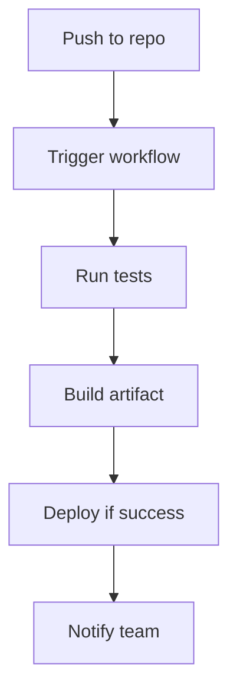

## Overview

GitHub provides essential tools for developers to manage code, collaborate, and automate workflows. You start with repositories as the foundation, use branches for safe experimentation, pull requests for reviews, issues for tracking work, and GitHub Actions for automation. These concepts form the backbone of effective development on the platform.

<Callout kind="info">
  Master these core concepts to streamline your workflow and collaborate efficiently with teams.
</Callout>

## Repositories

A repository (`repo`) is the central hub for your project. It stores all files, commit history, and branches. Structure your repo with a clear folder layout: `src/` for source code, `docs/` for documentation, `tests/` for test files, and a `README.md` for setup instructions.

<Steps>
  <Step title="Create a Repository" icon="repo">
    Visit `https://github.com/new` and enter your project name, like `my-app`. Add a description and initialize with a `README.md`.
  </Step>
  <Step title="Clone Locally" icon="download">
````bash
git clone https://github.com/your-username/my-app.git
cd my-app
````

  </Step>
  <Step title="Structure Files" icon="folder">
    Create directories:
````bash
mkdir src docs tests
touch README.md
git add . && git commit -m "Initial structure"
git push origin main
````

  </Step>
</Steps>

## Branching Strategies

Branches let you work on features or fixes without affecting the main codebase. Common strategies include Git Flow (feature branches) and GitHub Flow (simple topic branches).

<Tabs>
  <Tab title="GitHub Flow" icon="git-branch">
    Create a branch for each change, open a pull request, and merge after review.
    
    ```bash
    git checkout -b feature/user-auth
    # Make changes
    git commit -m "Add user authentication"
    git push origin feature/user-auth
    ```
  </Tab>
  <Tab title="Git Flow" icon="git-commit">
    Use `develop` for integration, `main` for releases, and types like `feature/`, `hotfix/`.
    
    ```bash
    git checkout develop
    git checkout -b feature/payment-api
    # Develop and push
    git checkout develop
    git merge feature/payment-api
    ```
  </Tab>
</Tabs>

## Pull Requests

Pull requests (PRs) facilitate code review and merging. They compare branches, show diffs, and allow discussions.

<CodeGroup tabs="CLI,Web">
  ```bash
  gh pr create --title "Add payment API" --body "Implements Stripe integration"
  ```
  ```markdown
  From GitHub web: New Pull Request → Select `feature/payment-api` → Add details → Create.
  ```
</CodeGroup>

<Callout kind="tip">
  Always link issues in PRs with `Fixes #123` to auto-close them on merge.
</Callout>

## Issues and Project Boards

Issues track bugs, features, and tasks. Assign labels like `bug`, `enhancement`. Project boards visualize progress with columns: To Do, In Progress, Done.

<Columns cols={2}>
  <Card title="Issues" icon="issue-closed" href="https://docs.github.com/en/issues">
    Create issues for actionable items. Use milestones for releases.
  </Card>
  <Card title="Project Boards" icon="board" href="https://docs.github.com/en/issues/planning">
    Drag issues between columns to update status automatically.
  </Card>
</Columns>

## GitHub Actions for CI/CD

GitHub Actions automates testing, building, and deployment via YAML workflows in `.github/workflows/`.



<Expandable title="Example CI Workflow" default-open="true">
  Create `.github/workflows/ci.yml`:

````yaml
name: CI Pipeline
on: [push, pull_request]
jobs:
  test:
    runs-on: ubuntu-latest
    steps:
      - uses: actions/checkout@v4
      - name: Run tests
        run: npm test
````

</Expandable>

## Best Practices

- Keep branches short-lived and descriptive.
- Use protected branches on `main` to require PR approvals.
- Integrate Actions early for fast feedback.

<Columns cols={3}>
  <Card title="Quickstart" icon="rocket" href="/quickstart">
    Set up your first repo.
  </Card>
  <Card title="Authentication" icon="key" href="/authentication">
    Secure your workflows.
  </Card>
  <Card title="Actions Guide" icon="play" href="/actions">
    Advanced automation.
  </Card>
</Columns>